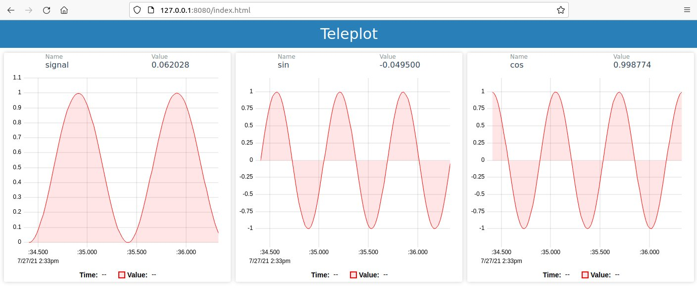

# Teleplot

A ridiculously simple tool to plot telemetry data from a running program and trigger function calls.



`echo "myData:4" | nc -u -w0 127.0.0.1 47269`

# Test it online

**Go to [teleplot.fr](https://teleplot.fr)**

# Supports

Teleplot project received the generous technical support of [Wandercraft](https://www.wandercraft.eu/).


# Start the server

## As a binary
```bash
cd server
npm i
sudo npm run-script make
./build/teleplot
```

> Current target is x64 and configurable in `package.json -> pkg/targets`

## Using node
```bash
cd server
npm i
node main.js
```

Open your navigator at [127.0.0.1:8080](127.0.0.1:8080)

## Using docker
```bash
cd server
docker build -t teleplot .
docker run -d -p 8080:8080 -p 47269:47269/udp teleplot
```

Open your navigator at [127.0.0.1:8080](127.0.0.1:8080)

## Using docker-compose
```bash
cd server
docker-compose build
docker-compose up
```

Open your navigator at [127.0.0.1:8080](127.0.0.1:8080)

# Telemetry Format

A telemetry gets published by sending a text-based UDP packet on the port `47269`. As it's a trivial thing to do on the vast majority of languages, it makes it very easy to publish from anywhere.

The telemetry format is inspired by `statsd` and *to some extents* compatible with it.

The expected format is `A:B:C§D|E` where:
- **A** is the name of the telemetry variable (be kind and avoid **`:|`** special chars in it!)
- **B** is **optional** and represents the timestamp in milliseconds (`1627551892437`). If omitted, like in `myValue:1234|g`, the reception timestamp will be used, wich will create some precision loss due to the networking.
- **C** is either the integer or floating point value to be plotted or a text format value to be displayed.
- **D** is **optional** and is the unit of the telemetry ( please avoid **`,;:|.`** special chars in it!)
- **E** is containing flags that carry information on how to read and display the data.

Examples:
- `myValue:1234`
- `myValue:1234|`
- `myValue:12.34e+2`
- `myValue:1627551892437:1234`
- `myValue:hello|t`
- `myValue:1234§km²`

### Plot XY rather than time-based

Using the `xy` flag, and providing a value in both **B** and **C** field, teleplot will display an YX line chart. 

- `trajectory:12.3:45.67|xy`

A timestamp can be associated with the xy point by adding an extra `:1627551892437` after the **C** field.

- `trajectoryTimestamped:1:1:1627551892437;2:2:1627551892448;3:3:1627551892459|xy`

The YX line chart will only be displayed when at least two values have been received.

> Using `clr` flag when sending a telemetry will clear the previous values. This is useful when streaming cyclic data like lidar points.

### Publishing text format telemetries
- Using the `t` flag and giving a text telemetry (with or without timestamp), teleplot will display a text chart.

- `motor_4_state:Turned On|t`
- `motor_4_state:1627551892437:Off|t`

### Publishing multiple points
/!\ here, many values will be received at the same time by teleplot, therefore you must precise their timestamps.

Multiple values of a single telemetry can be sent in a single packet if separated by a `;`

- `trajectory:1:1;2:2;3:3;4:4|xy`
- `myValue:1627551892444:1;1627551892555:2;1627551892666:3`
- `myValue:1627551892444:1;1627551892555:2;1627551892666:3§rad`
- `state:1627551892444:state_a;1627551892555:state_b|t`

### Publishing multiple telemetries

Multiple telemetries can be sent in a single packet if separated by a `\n`

```
myValue:1234
mySecondValue:1234:m/s
myThirdValue:1627551892437:1234
state:state_a|t
trajectory:1:1;2:2;3:3;4:4|xy
trajectoryTimestamped:1:1:1627551892437;2:2:1627551892448;3:3:1627551892459|xy
```

> Notice that your data needs to fit in a single UPD packet whick can be limited to 512(Internet), 1432(Intranets) or 8932(Jumbo frames) Bytes depending on the network.

### Prevent auto-plot of telemetry

By default, teleplot will display all the incoming telemetry as a chart, while this is handy for new user with small amount of data, this might not be desired with lots of data.
The `np` (for no-plot) flag can be used to prevent this behavior:
- `myValue:1627551892437:1234|np`
- `trajectory:12.3:45.67|xy,np`

### Publishing 3D telemetries

To send 3D shapes to teleplot, use this syntax : `3D|A:B:C|E`, where
**A** is the name of the shape telemetry
**B** is the timestamp of the telemetry and is **optional**
**C** is a text representing the shape
**E** is containing flags and is **optional**

### Writing **A** (the name of the shape telemetry)

if **A** contains a comma, the text after the comma will be considered as a 'widget label', if multiple telemtries are sent with the same
widget label, they will automatically be displayed on the same widget.
The text before the comma will be considered as the name of the shape telemetry.

If **A** doesn't contain a comma, its whole text will be considered as the name of the shape telemetry.

#### Writing **C** (the text representing the shape)

**C** is built as a concatenation of the shape properties followed by their values, the whole with colons in between.

LIST OF PROPERTIES : 

- "shape" or "S"  => the shape type (either "cube" or "sphere" for the moment).

- "position" or "P" => the position of the center of the sphere in a cartesian coordinate system 
    1st argument : x, 2nd argument : y, 3rd argument : z
    
- "rotation" or "R" => the rotation ( in radian ) of the shape using Euler angles ( please avoid this method and use a quaternion instead )
    1st argument : the rotation around the x axis, 2nd argument : the rotation around the y axis, 3rd argument : the rotation around the z axis
    
- "quaternion" or "Q" => the rotation of the shape using a quaternion
    1st argument : x coordinate, 2nd argument : y coordinate, 3rd argument : z coordinate, 4th argument : w coordinate
    
- "color" or "C" => the color of the shape, ex : "blue", "#2ecc71" ... 

- "opacity" or "O" => the opacity of the shape, float between 0 and 1, 0 being fully transparent and 1 fully opaque ( set to 1 by default ) 

=== Sphere only ===

- "precision" or "PR" => the number of rectangles used to draw a sphere (the bigger the more precise, by default = 15)

- "radius" or "RA"=> the radius of the sphere

=== Cube only ===

- "height" or "H" => the height of the cube ( Y axis )
- "width" or "W" => the width of the cube ( X axis )
- "depth" or "D" => the depth of the cube ( Z axis )


If you don't want to send all the arguments of a certain property, you still have to add colons ( ex : position::-1:1, here the x position is not given but colons are still present )

for unspecified properties, teleplot will use the ones from the previous shape state.

If it is the first time teleplot receives data of a certain shape, the property "shape" (cube or sphere) has to be given and
missing properties will be replaced by default ones.

Also, the shape, color and precision properties can not be changed later on.

#### Some examples
Creating a simple sphere and cube : 

    cube without timestamp :
    - `3D|mySimpleCube:S:cube:P:1:1:1:R:0:0:0:W:2:H:2:D:2:C:#2ecc71`

    sphere with timestamp : 
    - `3D|mySimpleSphere:1627551892437:S:sphere:P::2::RA:2:C:red`

Creating a cube that grows and rotates : 

    In the first request we send, we need to specify the shape:
    - `3D|my_super_cube:S:cube:W:1:D:1:H:1:C:blue`

    Then we can specify only properties that change :
    - `3D|my_super_cube:W:1.2:R::0.2:`
    - `3D|my_super_cube:W:1.4:R::0.4:`
    - `3D|my_super_cube:W:1.6:R::0.6:`

Creating a simple sphere and cube and display them on the same widget by default :

    cube with widget label 'widget0' :
    - `3D|myCube,widget0:S:cube`

    sphere with same widget label : 
    - `3D|mySphere,widget0:S:sphere`


/!\ Despite the examples above, it might be a better idea to send every property everytime, as if teleplot refreshes or if it wasn't lauched 
before you sent certain properties, it will not have any way to be aware of the properties you sent previously. 
Therefore, it will have to use default values, or may not display anything at all, if it is not informed of the shape type for instance.

/!\ If you send shapes at a too high frequency, teleplot will quickly be overloaded, also teleplot can only draw 3D shapes at a maximum speed 
of 50-60 frames per second, therefore it is not recommended to send more than 60 shapes per seconds.

# Publish telemetries

## Bash

```bash
echo "myValue:1234" | nc -u -w0 127.0.0.1 47269
```

## C++

Copy `Teleplot.h` (from `clients/cpp`) in your project and use its object.
```cpp
#include <math.h>
#include "Teleplot.h"
Teleplot teleplot("127.0.0.1");

int main(int argc, char* argv[])
{
    for(float i=0;i<1000;i+=0.1)
    {
        // Use instanciated object
        teleplot.update("sin", sin(i));
        teleplot.update("cos", cos(i), 10); // Limit at 10Hz

        // Use static localhost object
        Teleplot::localhost().update("tan", tan(i));
        
        usleep(10000);
    }
    return 0;
}
```

## Python

```python
import socket
import math
import time

teleplotAddr = ("127.0.0.1",47269)
sock = socket.socket(socket.AF_INET, socket.SOCK_DGRAM)

def sendTelemetry(name, value):
	now = time.time() * 1000
	msg = name+":"+str(now)+":"+str(value)
	sock.sendto(msg.encode(), teleplotAddr)

i=0
while i < 1000:
	
	sendTelemetry("sin", math.sin(i))
	sendTelemetry("cos", math.cos(i))

	i+=0.1
	time.sleep(0.01)
```

## Not listed?

You just need to send a UDP packet with the proper text in it. Open your web browser, search for `my_language send UDP packet`, and copy-paste the first sample you find before editing it with the following options:
	
- address: `127.0.0.1`
- port: `47269`
- your test message: `myValue:1234|g` 

# Remote function calls

Remote function calls is an optional feature that opens an UDP socket between the program and the Teleplot server to pull the list of registered functions and call them.

# Register a function

## C++

Copy `Telecmd.h` (from `clients/cpp`) in your project and use its object.
`Telecmd.h` and `Teleplot.h` can be used at the same time.

```cpp
#include "Telecmd.h"

int main(int argc, char* argv[])
{
    bool keepRunning = true;

    Telecmd::localhost().registerCmd("sayHello",[](std::string params){
        std::cout << "Hello " << params << std::endl;
    });

    Telecmd::localhost().registerCmd("stop",[&](std::string){
        std::cout << "Stopping..." << std::endl;
        keepRunning = false
    });

    // Main program loop
    while(keepRunning){
        Telecmd::localhost().run();
    }
    return 0;
}
```

## Call a function

Functions can be called from the Teleplot interface and will be auto-discovered, however, they can also be triggered by a simple UDP packet:

- With a string as parameter: `echo "|sayHello|world|" | nc -u -w0 127.0.0.1 47268`
- Without parameters: `echo "|stop|" | nc -u -w0 127.0.0.1 47268`

## Send a text log

Along with telemetries, you can also send text logs to be display in a console-like manner:

`echo ">:Hello world" | nc -u -w0 127.0.0.1 47269`

By adding a millisecond timestamp to your log, you can sync them with the charts.

`echo ">1627551892437:Hello world" | nc -u -w0 127.0.0.1 47269`
