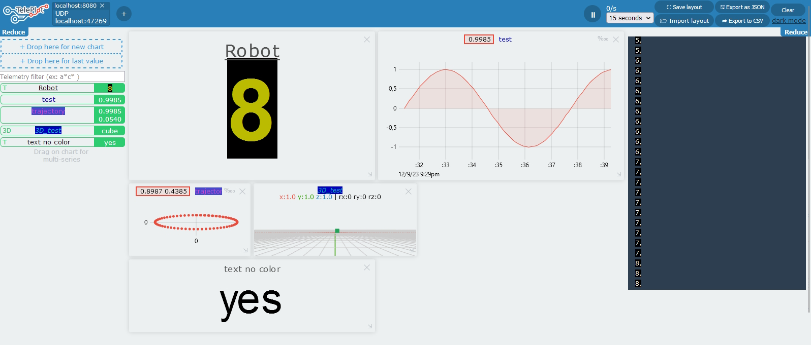

# Teleplot

A ridiculously simple tool to plot telemetry data from a running program.



`echo "myData:4|g" | nc -u -w0 127.0.0.1 47269`

# Start the server

## As a binary
```bash
cd server
npm i
sudo npm run-script make
./build/teleplot
```

> Current target is x64 and configurable in `package.json -> pkg/targets`

## Using node
```bash
cd server
npm i
node main.js
```

Open your navigator at [127.0.0.1:8080](127.0.0.1:8080)

## Using docker
```bash
cd server
docker build -t teleplot .
docker run -d -p 8080:8080 -p 47269:47269/udp teleplot
```

Open your navigator at [127.0.0.1:8080](127.0.0.1:8080)

## Using docker-compose
```bash
cd server
docker-compose build
docker-compose up
```

Open your navigator at [127.0.0.1:8080](127.0.0.1:8080)

# Publish telemetry

## Format

The telemetry format is inspired by `statsd` and *to some extents* compatible with it.

The expected format is `A:B:C|D` where:
- **A** is the name of the telemetry variable (be kind and avoid `:|` special chars in it!)
- **B** is the integer or floating point value
- **C** is optional and represents the timestamp in milliseconds. If omitted like in `myValue:1234|g`, the reception timestamp will be used, wich will create some precision loss due to the networking.
- **D** is the data type/representation wich is currently *completely unused*, but requested!

## Bash

```bash
echo "myValue:1234|g" | nc -u -w0 127.0.0.1 47269
```

## C++

Copy `Teleplot.h` (from `clients/cpp`) in your project and use its object.
```cpp
#include <math.h>
#include "Teleplot.h"
Teleplot teleplot("127.0.0.1");

int main(int argc, char* argv[])
{
    for(float i=0;i<1000;i+=0.1)
    {
        // Use instanciated object
        teleplot.update("sin", sin(i));
        teleplot.update("cos", cos(i), 10); // Limit at 10Hz

        // Use static localhost object
        Teleplot::localhost().update("tan", tan(i));
        
        usleep(10000);
    }
    return 0;
}
```

# Desired futur features/improvments

 - Create a visual explaining how it works
 - Export data in CSV format
 - Select data to display
 - allow X/Y plots rather than forcing a timescale on X
 - Add a clear button or a notion of session